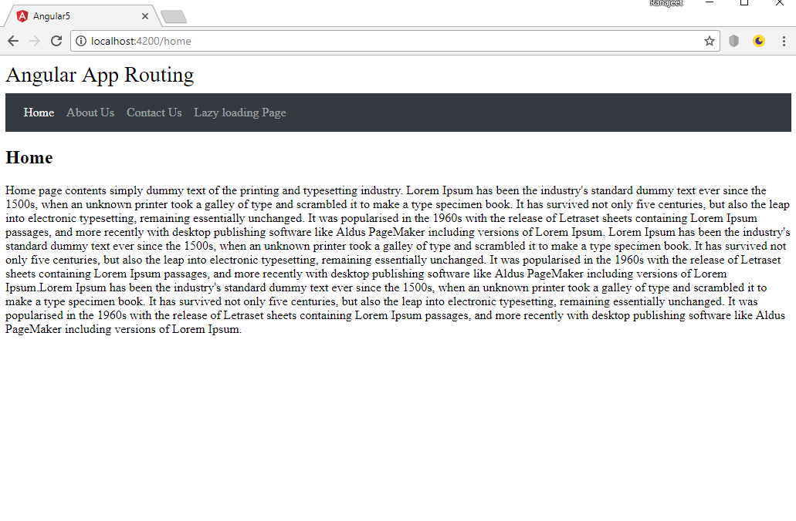

# Angular5-Route with lazy loading


It is a Angular5 routing or Single Page Application (SPA). It is a web app that loads a single HTML page and dynamically updates that page as the user interacts with the web app. Here I have added lazy loading functionlity. Lazy loading loads only what we need to use when first starting up the application. if user navigate to a new page, then the Lazy loading load only that component for that page.

<p align="center">
    
</p>

To preview demo of Angular5 routing project, [click here](https://stackblitz.com/edit/angular5-route?embed=1&file=index.html&hideExplorer=1&hideNavigation=1&view=preview)


## Getting Started
Download  or Clone the repository in your machine and run following command.

### Installing
    - npm install

### Run server
    - ng serve
    
## Below are the lazy loading steps for who want to build step by step


### Import the module

In `lazyloading.module.ts`,

```javascript
...

@NgModule({
  imports: [
    CommonModule,
    LazyloadingRoutingModule
  ],
  declarations: [LazyloadingListComponent]
})
export class LazyloadingModule { }


```

### Usage : 

In `lazyloading-routing.module.ts`,

```javascript
const routes: Routes = [
{
    path: '',
    component: LazyloadingListComponent
  }

];

@NgModule({
  imports: [RouterModule.forChild(routes)],
  exports: [RouterModule]
})

export class LazyloadingRoutingModule { }

```

In `lazyloading/lazyloading-list.component.ts`,

```javascript
import { Component, OnInit } from '@angular/core';

@Component({
  selector: 'app-lazyloading-list',
  templateUrl: './lazyloading-list.component.html',
  styleUrls: ['./lazyloading-list.component.css']
})
export class LazyloadingListComponent implements OnInit {

  constructor() { }

  ngOnInit() {
  }

}
```

In 'app-routing.module.ts',
```javascript
main route added the lazy loading route

  { path: 'lazyloading', loadChildren: 'app/lazyloading/lazyloading.module#LazyloadingModule' }

```
In `lazyloading/lazyloading-list.component.html`,

```html
<p>
  lazyloading.module.chunk.js is called now
</p>           
```
